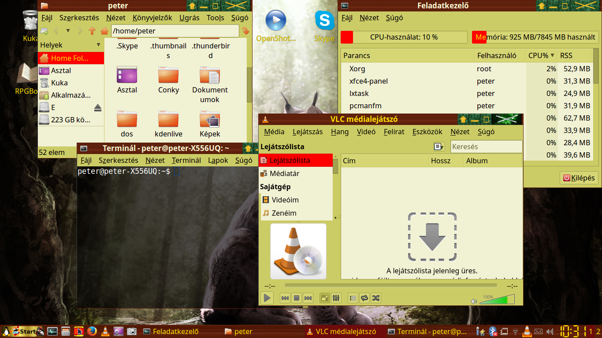
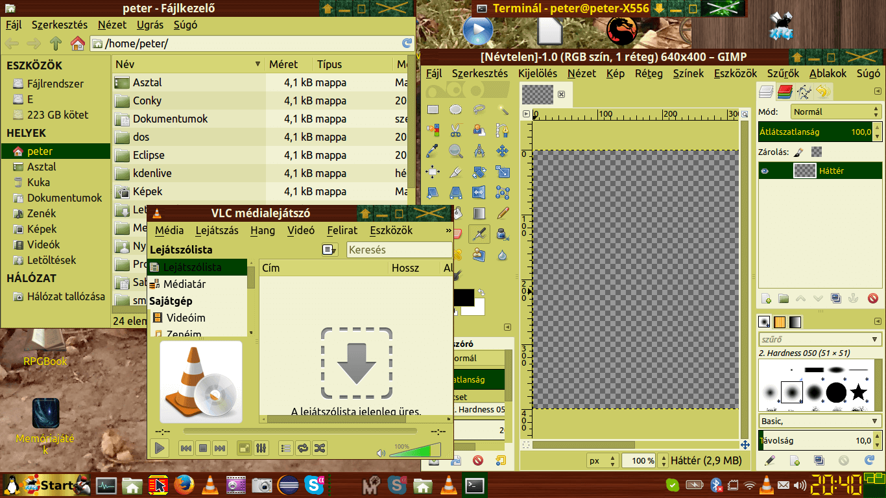
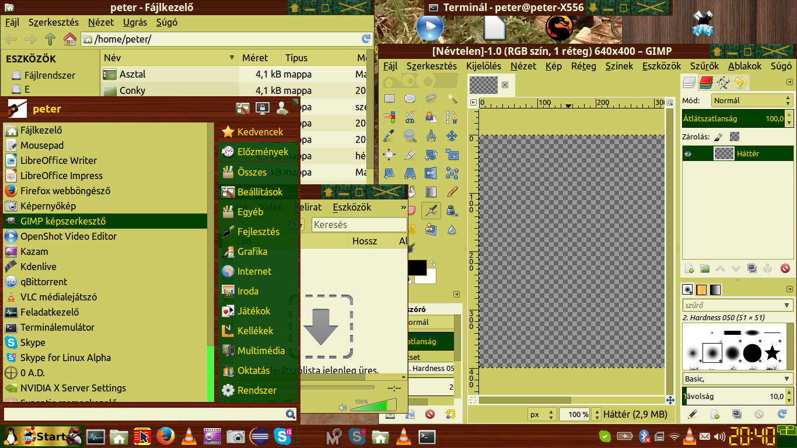
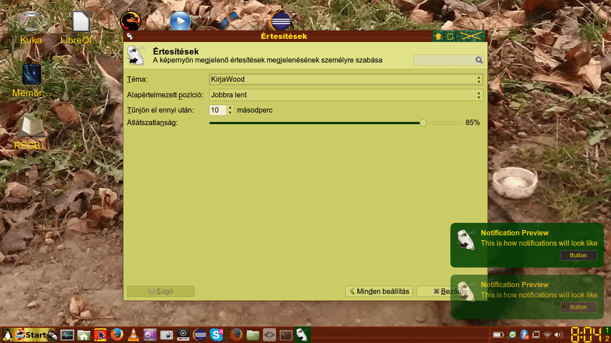

This is my xfce4 theme repository.

<h1>1. KirjaWood</h1>

 

 

<h2>Install:</h2> 
<h3>Automatic install</h3>
<a href="https://github.com/vpeter93/xfce4-themes/blob/master/KirjaWood/Release">Download installKirjaWoodTheme.sh from KirjaWood/Release folder.</a> 
Run installKirjaWoodTheme.sh in the terminal like this: 
sudo sh installKirjaWoodTheme.sh 
<h3>Manual install</h3>
<a href="https://github.com/vpeter93/xfce4-themes/blob/master/KirjaWood/Release">You can find KirjaWood.tar.gz in KirjaWood/Release folder.</a> 
Download KirjaWood.tar.gz  
Unpack the file to /usr/share/themes  