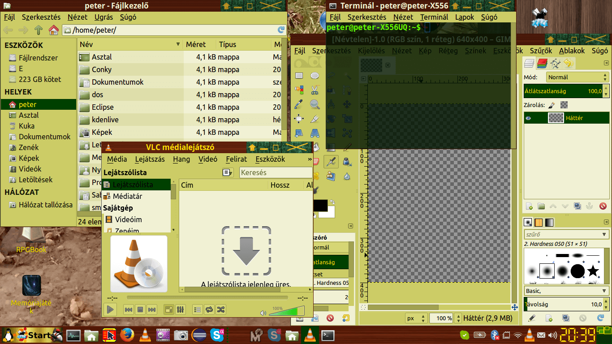

This is my xfce4 theme repository.

<h1>1. KirjaWood</h1>

 

<h2>Install:</h2> 
You can find KirjaWood.tar.gz in KirjaWood/Release folder.
Download KirjaWood.tar.gz
Unpack the file to /usr/share/themes